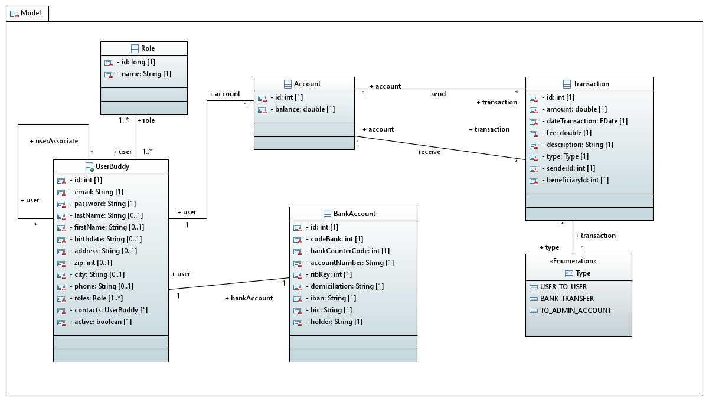
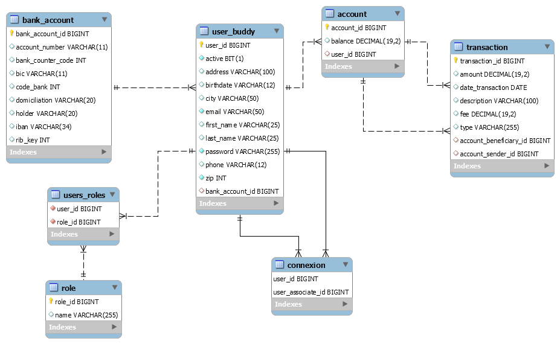

# Pay My Buddy 

Prototype money transfer web application. The objective of this prototype to date is to set up the data access layer.  
 The web interface is based on the models provided and makes it possible to use the DAL layer.

# Getting Started

These instructions will get you a copy of the project up and running on your local machine for development and testing purposes.  
See deployment for notes on how to deploy the project on a live system.

# Prerequisites

What things you need to install the software and how to install them

* Java 11

* Maven 4.0.0

* Spring boot 2.4.3  

* MySql 8.0.22

# Installing

A step by step series of examples that tell you how to get a development env running:

* Install Java:
https://docs.oracle.com/javase/8/docs/technotes/guides/install/install_overview.html

* Install Maven:
https://maven.apache.org/install.html

* Install Spring tools suit
https://spring.io/tools  
  
* Install MySql:  
https://dev.mysql.com/downloads/mysql/  
  
After downloading the mysql 8 installer and installing it, you will be asked to configure the password for the default  
root account. This code uses the default root account to connect and the password can be set as rootroot.  
If you add another user/credentials make sure to change the same in the code base.

it is recommended to change the username and password. the identifiers are in the application.properties file   
in the resources folder. To run the integration tests, make sure to also modify the connection identifiers in the  
application.properties file in the tests resources folder.  
  
# Before Running App  
  
Before running the application, you must create the database with the following commands:  

CREATE DATABASE pay_my_buddy CHARACTER SET utf8;  

USE pay_my_buddy;  

When the application is run for the first time, the tables will be created automatically using Spring Boot and Spring Data,  
so there is no need to execute the commands provided in the sql file named schema.sql.
However, before running the integration tests, you will have to create the database with the following commands :  
CREATE DATABASE pay_my_buddy_test CHARACTER SET utf8;  
USE pay_my_buddy_test;   
The data.sql insertion file found in the resources folder of the tests will be executed automatically   
at launch integration tests.  
If you want to create the tables before running the application you can run the commands in the create-db.sql file in the resources folder  
(as well as for the tests)

# Running App

Post installation of Spring Boot, Java, Maven and MySql, you will have to be ready to import the code into an IDE of your choice  
and run the server to launch the application.

# Testing

The app has unit tests written.
To run the tests from maven, go to the folder that contains the pom.xml file and execute the below command.
mvn site and mvn test to produce some reports (surefire, JaCoCo).

# UML diagram Explaining the class structure of the models  
  
    
    
# Physical data model Explaining the structure of the database tables
  
  

# Deployment

Then there are three possibilities to deploy the project :

* Through the IDE with "Run as", "Spring Boot App".

* With the maven spring-boot:run goal.

* By running the JAR using the java -jar command.

